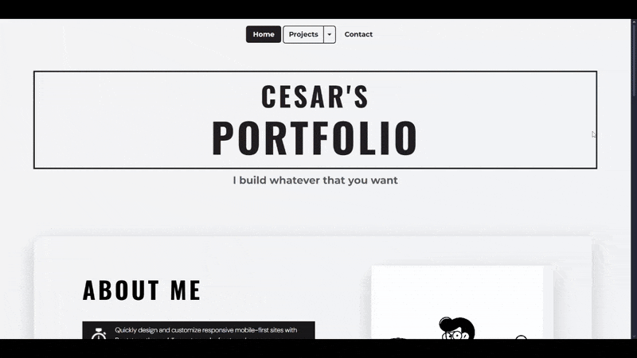
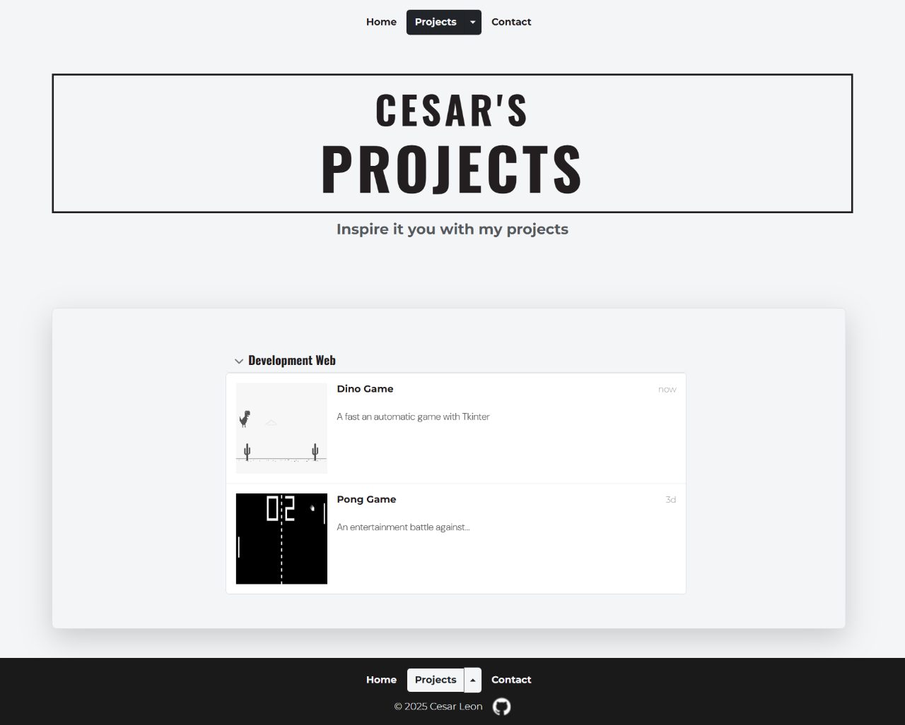
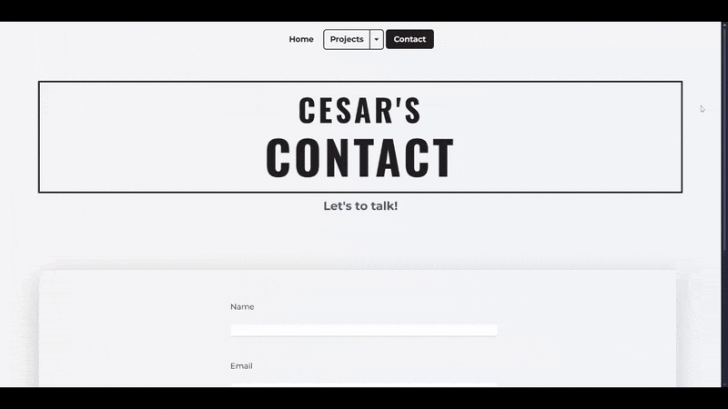

# 🌐 Portfolio – Personal Website

A personal portfolio website built with Python (Flask), HTML, and CSS.

---

## 🌍 Overview

Portfolio is my very first web project, created as part of the **100 Days of Python** course.

The website was designed to:

- Introduce myself
- Showcase my projects (initially placeholders)
- Provide a simple way for visitors to get in touch

Inspired by a Canva template, it was fully implemented from scratch using Flask and Jinja templates.

---

## ✨ Features

- 🏠 Home page with introduction and personal background
- 📂 Projects section (initial placeholder for future projects)
- 📞 Contact page linked to WhatsApp for easy communication
- 🖼 Template system with reusable `base.html`
- 🎨 Responsive design with custom CSS

---

## 📸 Showcase

### 🏠 Homepage



### 🚀 Projects



### 📞 Contact



---

## 🛠 Tech Stack

- **Backend:** Flask (Python), Jinja Templates
- **Frontend:** HTML5, CSS3
- **Tools:** Canva (design inspiration), custom responsive CSS

---

## 📂 Project Structure

```text
Portfolio/
│── main.py
│── requirements.txt
│
├── static/
│ ├── assets/
│ └── styles.css
│
├── templates/
│ ├── base.html
│ ├── index.html
│ ├── projects.html
│ └── contact.html
│
└── README.md
```

---

## ⚙️ Installation & Setup

### Clone repository:

```bash
git clone https://github.com/fockus26/portfolio.git
cd portfolio
```

### Install dependencies:

```bash
pip install -r requirements.txt
```

### Run

```bash
python main.py
```

The app will run on:
👉 http://localhost:5000

---

## 📖 Case Study

This project served as my entry point into web development.

While simple in functionality, it represents my first hands-on experience with Flask, HTML, and CSS. It also demonstrates how I approached design adaptation (from Canva inspiration to code) and laid the foundation for future projects such as Blog and Café.

---

## 📈 Future Improvements

- 📂 Add dynamic project showcase with database integration

- 🌐 Multilingual support (English / Spanish)

- 📱 Mobile-first redesign using modern frameworks (Bootstrap / TailwindCSS)

- 📩 Contact form with email integration
